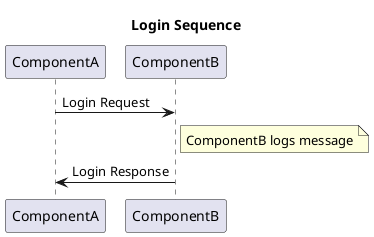
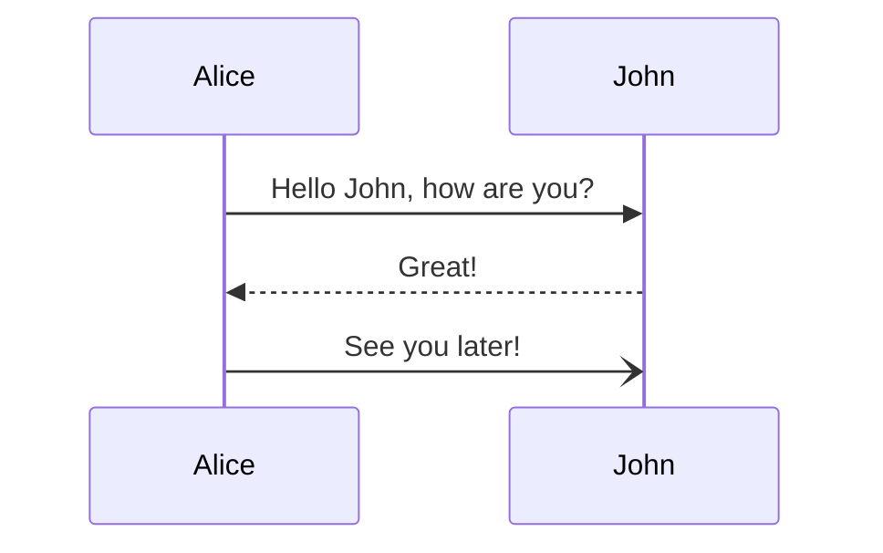

### Code example

```
interface IpsumDolor {
  lorem: string;
  amet: number;
  consectetur: boolean;
  adipiscing?: string[];
}

type SitAmet = 'lorem' | 'ipsum' | 'dolor' | 'sit' | 'amet';

enum ConsecteturEnum {
  Lorem = 'LOREM',
  Ipsum = 'IPSUM',
  Dolor = 'DOLOR',
}
```

### PlantUML



### Mermaid


